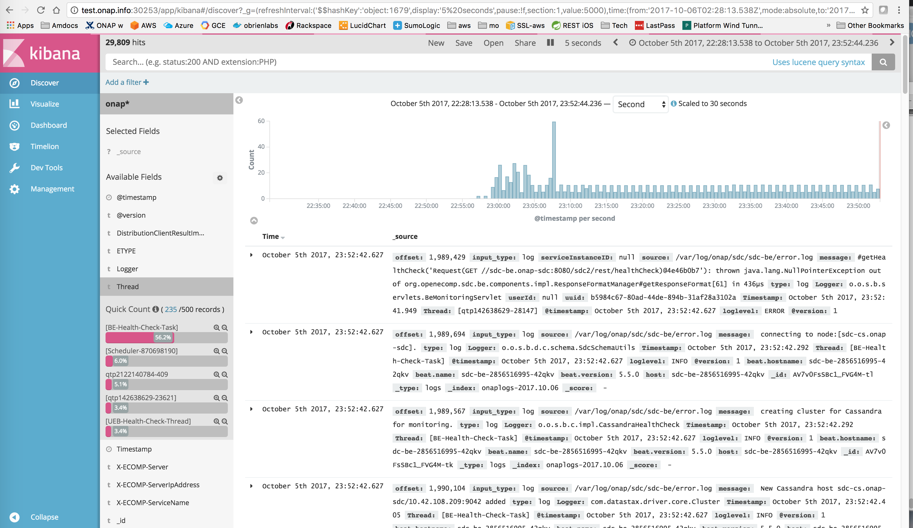

.. This work is licensed under a Creative Commons Attribution 4.0 International License.
.. http://creativecommons.org/licenses/by/4.0
.. Copyright © 2017 AT&T Intellectual Property. All rights reserved.

Logging User Guide
==================
.. contents::
   :depth: 3
..

ONAP Kibana Dashboard
---------------------

Logging Design
--------------

Repositories

+-----------------+-----------------------+-----------------------------------+
| **Repo**        |**Directory**          |**Details**                        |
+=================+=======================+===================================+
|oom              |                       |Deployment yamls                   |
+-----------------+-----------------------+-----------------------------------+
|oom              |                       |configs                            |
+-----------------+-----------------------+-----------------------------------+
|logging-analytics|                       |docker image configs               |
+-----------------+-----------------------+-----------------------------------+
|logging-analytics|                       |reference logback.xml configs      |
+-----------------+-----------------------+-----------------------------------+
|(various) aai..  |                       |runtime logback.xml/log4j configs  |
+-----------------+-----------------------+-----------------------------------+

