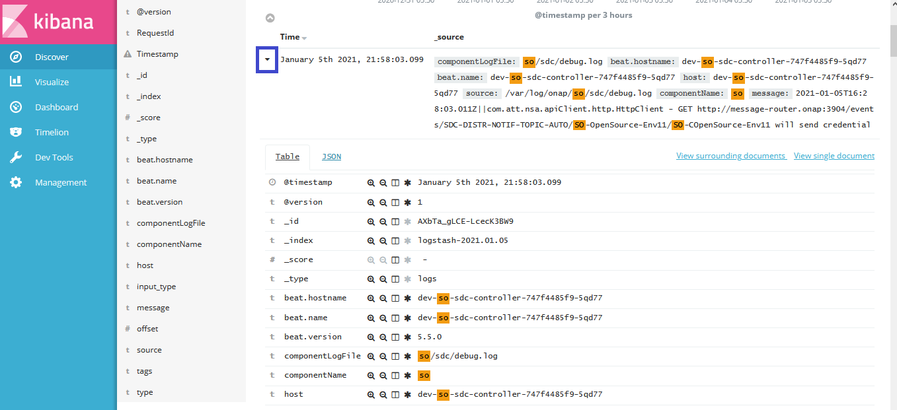
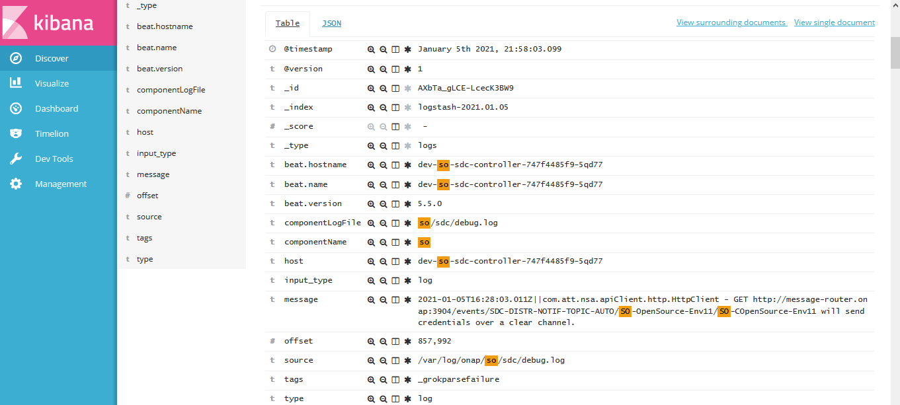

.. This work is licensed under a Creative Commons Attribution 4.0
.. International License. http://creativecommons.org/licenses/by/4.0
.. Copyright © 2017-2020 Aarna Networks, Inc.
.. Links
.. _Elastic Stack: https://www.elastic.co/products
.. _Elasticsearch: https://www.elastic.co/elasticsearch
.. _Kibana Discover: https://www.elastic.co/guide/en/kibana/current/discover.html

ONAP Log Analytics
##################

The purpose of the ONAP Log Analytics project is to provide standardized logs across all ONAP components using ELK framework for log capture, indexing and presentation/search.

Logging Architecture
====================

ONAP uses ELK stack for centralized logging for all the ONAP components. ELK stands for Elastic search, Logstash, Kibana. The aggregated logging framework uses Filebeat to send logs from each pod to the ELK stack where they are processed and stored. This requires each pod to have an additional container which will run Filebeat, and for the necessary log files to be accessible between containers. We use filebeat as a side car container for all the onap components to push logs to the logstash node port.

|logging-architecture|

Deploy ONAP Logging Component
=============================

Following are the detailed steps to install the logging component and access the ONAP component’s logs via centralized dashboard UI called Kibana discover.

.. note::

   The logging analytics stack (Elasticsearch, Logstash, Kibana) is provided as part of the OOM deployment via the component log.

1) Check if the logging component is deployed
---------------------------------------------

Run the below command to check if the logging component is installed.

::

  helm list | grep -i log
  dev-log                 1               Thu Dec 10 10:47:05 2020        DEPLOYED        log-6.0.0                               onap

If it does not return anything that means log component is not deployed.

2) Deploy log component (If it is not deployed)
-----------------------------------------------

a) Get the helm chart for log component
~~~~~~~~~~~~~~~~~~~~~~~~~~~~~~~~~~~~~~~~

::

  helm search | grep log
  local/log               6.0.0                           ONAP Logging ElasticStack

b) Deploy log component
~~~~~~~~~~~~~~~~~~~~~~~~

::

  helm upgrade --install dev-log local/log --namespace onap --timeout 900 --set 'flavor=unlimited'

3) Verify if log component is deployed now
------------------------------------------

a) Verify the log component deployment status
~~~~~~~~~~~~~~~~~~~~~~~~~~~~~~~~~~~~~~~~~~~~~

::

  helm list | grep -i log
  dev-log                 1               Thu Dec 10 10:47:05 2020        DEPLOYED        log-6.0.0                               onap

The status should show as deployed.

b) Verify that all the logging pods are up and running
~~~~~~~~~~~~~~~~~~~~~~~~~~~~~~~~~~~~~~~~~~~~~~~~~~~~~~

::

  kubectl get pod -n onap | grep log-
  dev-log-elasticsearch-6c8f844446-rjpvs             1/1     Running            0          10d
  dev-log-kibana-6d57c74667-t6hm2                    1/1     Running            0          10d
  dev-log-logstash-7fb656b4c9-2mttc                  1/1     Running            0          10d
  dev-log-logstash-7fb656b4c9-jdkdf                  1/1     Running            0          10d
  dev-log-logstash-7fb656b4c9-zmtl7                  1/1     Running            0          10d
  dev-modeling-etsicatalog-744b5b5955-5khg8          2/2     Running            1          12d
  dev-so-catalog-db-adapter-988fb5db4-qzgss          1/1     Running            0          11d

All the pods should be up and running.

c) Verify that all the log pods are exposed
~~~~~~~~~~~~~~~~~~~~~~~~~~~~~~~~~~~~~~~~~~~

::

  kubectl get svc -n onap | grep log-
  log-es                             NodePort       10.43.85.25     <none>                                 9200:30254/TCP                                           10d
  log-es-tcp                         ClusterIP      10.43.26.175    <none>                                 9300/TCP                                                 10d
  log-kibana                         NodePort       10.43.189.12    <none>                                 5601:30253/TCP                                           10d
  log-ls                             NodePort       10.43.160.207   <none>                                 5044:30255/TCP                                           10d
  log-ls-http                        ClusterIP      10.43.208.52    <none>                                 9600/TCP                                                 10d

All the pods are exposed.

ONAP components with filebeat containers
========================================

As mentioned already ONAP logging framework uses Filebeat to send logs from each pod to the ELK stack where they are processed and stored. Below is the list of ONAP components with filebeat containers.

::

  kubectl get pods -n onap | grep 2/2

  dep-dcae-hv-ves-collector-868f7b7ffc-9mgk6         2/2     Running            0          12d
  dep-dcae-prh-8499df6dcf-x2bz7                      2/2     Running            0          12d
  dep-dcae-tca-analytics-cc44cb89-8qg2p              2/2     Running            0          12d
  dep-dcae-tcagen2-6d59df6fb4-85qtr                  2/2     Running            0          12d
  dep-dcae-ves-collector-55f5b4f469-jd5xd            2/2     Running            0          12d
  dev-aaf-sms-vault-0                                2/2     Running            0          12d
  dev-aai-babel-79d8d4f674-9l4h6                     2/2     Running            0          12d
  dev-aai-data-router-66d8897bc6-6vw77               2/2     Running            0          12d
  dev-aai-graphadmin-7664654967-t78kb                2/2     Running            0          12d
  dev-aai-modelloader-7486f7c665-8bmvp               2/2     Running            0          12d
  dev-aai-resources-5c996776fd-nvdbq                 2/2     Running            0          12d
  dev-aai-schema-service-c9464576-5z4nh              2/2     Running            0          12d
  dev-aai-search-data-6c899c7466-8qvkx               2/2     Running            0          12d
  dev-aai-sparky-be-8f5569986-j88kv                  2/2     Running            0          12d
  dev-aai-traversal-6b89655c6d-r8kkf                 2/2     Running            0          12d
  dev-dcae-dashboard-7c4d647c68-hpqqr                2/2     Running            0          12d
  dev-dcae-deployment-handler-68ff4db5d5-jk62q       2/2     Running            0          12d
  dev-dcae-inventory-api-6d584b55d5-lzh8m            2/2     Running            0          12d
  dev-dcae-policy-handler-587bb84c49-9gpd4           2/2     Running            0          12d
  dev-dcaemod-genprocessor-78c588cfb5-9v5q2          2/2     Running            0          12d
  dev-dmaap-dr-node-0                                2/2     Running            0          12d
  dev-dmaap-dr-prov-745f65979c-vw97l                 2/2     Running            0          12d
  dev-esr-server-759ccd4fcd-tvq48                    2/2     Running            0          12d
  dev-modeling-etsicatalog-744b5b5955-5khg8          2/2     Running            1          12d
  dev-msb-discovery-5fb7c77c97-khl72                 2/2     Running            0          12d
  dev-msb-eag-bdff68dbf-7rprj                        2/2     Running            0          12d
  dev-msb-iag-5cd9744464-nq5dz                       2/2     Running            0          12d
  dev-multicloud-6b6d7f9f4c-szbsx                    2/2     Running            0          12d
  dev-multicloud-azure-56d85dfbf-jshpp               2/2     Running            0          12d
  dev-multicloud-k8s-5498c868b4-2vzw8                2/2     Running            0          12d
  dev-multicloud-pike-6697844fb5-5ckj7               2/2     Running            0          12d
  dev-multicloud-vio-69d6cb7cfd-g87xh                2/2     Running            0          12d
  dev-pdp-0                                          2/2     Running            0          12d
  dev-policy-5f85767b74-c5btk                        2/2     Running            0          12d
  dev-portal-app-6f5cbdbf6f-z5w9g                    2/2     Running            0          12d
  dev-portal-sdk-79ffcff9d5-56xj8                    2/2     Running            0          12d
  dev-sdc-be-68b4dddf69-qz9d6                        2/2     Running            0          9d
  dev-sdc-dcae-be-95dcd7ccf-kk9pc                    2/2     Running            0          9d
  dev-sdc-dcae-dt-6c8568db54-4jvgv                   2/2     Running            0          9d
  dev-sdc-dcae-fe-66894f8765-dx2t6                   2/2     Running            0          9d
  dev-sdc-dcae-tosca-lab-59d6f8b74f-2985g            2/2     Running            0          9d
  dev-sdc-fe-59977f556d-qmszf                        2/2     Running            0          9d
  dev-sdc-onboarding-be-679c4df66c-4kskk             2/2     Running            0          9d
  dev-sdc-wfd-fe-54f8596994-zvpgp                    2/2     Running            0          9d
  dev-sdnc-0                                         2/2     Running            0          12d
  dev-sdnrdb-coordinating-only-544c5bc596-49gw7      2/2     Running            0          12d
  dev-so-6cb779c78b-fqrkx                            2/2     Running            0          11d
  dev-so-bpmn-infra-6b8cdb54f7-vcm5f                 2/2     Running            0          11d
  dev-so-openstack-adapter-7584878db6-srpjs          2/2     Running            0          11d
  dev-so-sdc-controller-747f4485f9-tjwhb             2/2     Running            0          11d
  dev-so-sdnc-adapter-5c5f98bf7f-cbd2c               2/2     Running            0          11d
  dev-vfc-generic-vnfm-driver-7f459b74cf-2kcq9       2/2     Running            0          12d
  dev-vfc-huawei-vnfm-driver-5b57557467-5j87x        2/2     Running            0          12d
  dev-vfc-juju-vnfm-driver-6455bd954b-zbfwh          2/2     Running            0          12d
  dev-vfc-nslcm-6d96959f5f-9fpdm                     2/2     Running            0          12d
  dev-vfc-resmgr-7768d6889d-rlw87                    2/2     Running            0          12d
  dev-vfc-vnflcm-86f65c4459-gz9q7                    2/2     Running            0          12d
  dev-vfc-vnfmgr-5cb6467fdd-wbcfb                    2/2     Running            0          12d
  dev-vfc-vnfres-5c5c69885b-bh59q                    2/2     Running            1          12d
  dev-vfc-zte-vnfm-driver-66c978dfc7-l57vq           2/2     Running            0          12d
  dev-vid-688f46488f-ctlwh                           2/2     Running            0          12d

For examples, let’s look at SO component and check the filebeat container details.

::

  kubectl get pods -n onap | grep 'dev-so-'
  dev-so-6cb779c78b-fqrkx                            2/2     Running            0          11d
  dev-so-appc-orchestrator-5df5cc4f9b-2mwgm          1/1     Running            0          11d
  dev-so-bpmn-infra-6b8cdb54f7-vcm5f                 2/2     Running            0          11d
  dev-so-catalog-db-adapter-988fb5db4-qzgss          1/1     Running            0          11d
  dev-so-mariadb-config-job-zqp56                    0/1     Completed          0          12d
  dev-so-monitoring-c69f6bdf8-ldxn8                  1/1     Running            0          11d
  dev-so-nssmf-adapter-6fdbbbbf57-6prlq              1/1     Running            0          11d
  dev-so-openstack-adapter-7584878db6-srpjs          2/2     Running            0          11d
  dev-so-request-db-adapter-8467c89c76-g4hgt         1/1     Running            0          11d
  dev-so-sdc-controller-747f4485f9-tjwhb             2/2     Running            0          11d
  dev-so-sdnc-adapter-5c5f98bf7f-cbd2c               2/2     Running            0          11d
  dev-so-ve-vnfm-adapter-7fb59df855-98n98            1/1     Running            0          11d
  dev-so-vfc-adapter-5cd8454bb6-gvklj                1/1     Running            0          11d
  dev-so-vnfm-adapter-678f655bff-q9cr9               1/1     Running            0          11d

In the above output notice that there are 3 pods with status as 2/2 running, which means those pods has 2 containers in it and these are pods which contains filebeat containers.

Now use the following command to check the filebeat container details for one of the SO pod.

::

  kubectl describe pod -n onap dev-so-6cb779c78b-fqrkx | grep -i filebeat
  so-filebeat-onap:
    Image:          docker.elastic.co/beats/filebeat:5.5.0
    Image ID:       docker-pullable://docker.elastic.co/beats/filebeat@sha256:fe7602b641ed8ee288f067f7b31ebde14644c4722d9f7960f176d621097a5942
      /usr/share/filebeat/data from dev-so-data-filebeat (rw)       /usr/share/filebeat/filebeat.yml from dev-so-filebeat-conf (rw,path="filebeat.yml")
  dev-so-filebeat-conf:
    Name:      dev-so-so-filebeat-configmap
  dev-so-data-filebeat:

So, we have seen that ELK stack and filebeat containers are being deployed and configured as part of the OOM deployment.

Access Kibana UI to visualize the ONAP component’s logs
=======================================================

The frontend UI, Kibana, can be accessed from a web browser on the port 30253. Below is the command showing that the log-kibana service is exposed to a Nodeport 30253.

::

  kubectl get svc -n onap | grep log-kibana
  log-kibana                         NodePort       10.43.189.12    <none>                                 5601:30253/TCP                                           10d

Follow the below steps to access Kibana UI and view the logs
------------------------------------------------------------

1) To launch the Kibana UI, navigate to http://<vm-ip-address>:30253 in your browser. Refer the below screen shot for the same.

|image1|

2) Provide the Index name or pattern as logstash-* and time filter field as timestamp and then click on create button.

|image2|

3) Click on Visualize in the left pane and then click on create a visualization.

|image3|

4) Now click on Data table as shown below.

|image4|

5) Now you will choose the search source. You can see the logstash-* is available in list,click on it.

|image5|

6) Select the bucket type as split rows as shown in the below screen shot.

|image6|

7) Provide the following details.

|image7|

8) Click on options, enter the values for per page and click on apply changes.

|image8|

9) Click on clock icon in the top right corner, then select the time range as last 7 days. Click on Auto-refresh and select the desired auto-refresh frequency and then click the apply changes button.

|image9|

10) Now you can see, it has populated the list of all onap component logs.

|image10|

11) Click on Discover in the left pane and it will populate the logs.

|image11|

12) You can search the logs for any component. Just provide the component name in the search field. For example we have entered SO.

|image12|

13) Now you can see the log details by clicking on the expand sign for any particular date and time.

|image13|

|image14|

